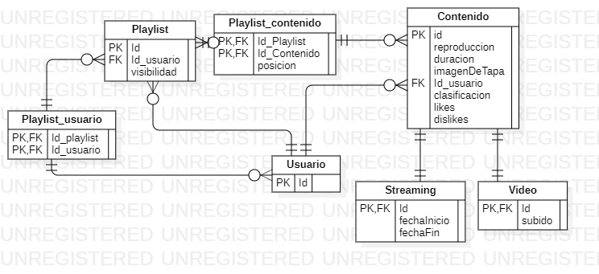

# parcial-2videos-solucion

[2Videos](https://docs.google.com/document/d/14vdCNQwkK23qBotHCSzDI1dLv1_bgE7PGDkM6w5N9UA/edit#)

## Resolucion

### Parte A persistencia

```java
/*Me parece que hay dos estrategias válidas de mapeo de herencia acá, Single Table y Joined.
Ambas permiten consultas polimórficas, lo que necesitamos dado que se querrá filtrar por contenido, y no por video/streaming.
Por una cuestión de normalización me inclino por la alternativa de JOINED, sin embargo si llegase a afectar considerablemente a la performance, iría por Single Table.
*/
@Entity
@Inheritance(strategy=InheritanceType.JOINED)
abstract class Contenido{
//Los atributos de esta clase se persisten sin problema.
@Id
@GeneratedValue
long Id
reproducciones
duracion
imagenDeTapa
@Enumerated(EnumType.String)
@Colum(name="clasificacion")
Clasificacion clasificacion
@Embedded
Estadistica estadistica
@ManyToOne
Usuario propietario
}

@Entity
class Video extends Contenido{
LocalDate subido
}

@Entity
class Streaming extends Contenido{
LocalDate fechaInicio
LocalDate fechaFin
}

enum Clasificacion{
  MENORES,
  ADOLESCENTES,
  ADULTOS
}

@Entity
class Usuario{
@Id
@GeneratedValue
long Id
}

@Entity
class Playlist{
@Id
@GeneratedValue
long Id
@ManyToMany
@OrderColumn(name="posicion")
List<Contenido> contenidos
@ManyToOne
Usuario usuarioPropietario
@ManyToMany
Collection<Usuario> usuariosCompartidos
@Enumerated
Visibilidad visibilidad
}

//La visibilidad no tiene estado, por lo que en lugar de elegir una estrategia de herencia (cambiando interface por abstract), es mejor idea realizar un cambio por un Enum con comportamiento.

enum Visibilidad{
  NoListada,
  Privada,
  Publica,
  
  /*
  Implementar validarAcceso
  */
}

//Esta clase no tiene comportamiento, ni me interesa que una instancia pueda ser compartida por varios objetos, sería más un value object que una entidad
@Embedable
class Estadistica{
likes
dislikes
}

#### Diagrama de clases

```

