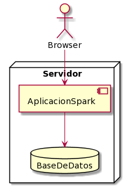
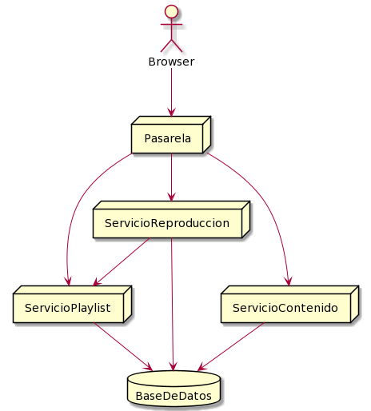

# parcial-2videos-solucion

[2Videos](https://docs.google.com/document/d/14vdCNQwkK23qBotHCSzDI1dLv1_bgE7PGDkM6w5N9UA/edit#)

# Resolucion

## Parte A - Persistencia

```java
/*Me parece que hay dos estrategias válidas de mapeo de herencia acá, Single Table y Joined.
Ambas permiten consultas polimórficas, lo que necesitamos dado que se querrá filtrar por contenido, y no por video/streaming.
Por una cuestión de performance, y porque los atributos distintos son muy pocos, voy por Single Table.
*/
@Entity
@Inheritance(strategy=InheritanceType.SINGLE_TABLE)
@DiscrimatorColum(name="tipo_contenido")
abstract class Contenido{
//Los atributos de esta clase se persisten sin problema.
@Id
@GeneratedValue
long Id
reproducciones
duracion
imagenDeTapa
@Enumerated(EnumType.String)
@Colum(name="clasificacion")
Clasificacion clasificacion
@Embedded
Estadistica estadistica
@ManyToOne
Usuario propietario
}

@Entity
@DiscriminatorValue(value="video")
class Video extends Contenido{
LocalDate subido
}

@Entity
@DiscriminatorValue(value="streaming")
class Streaming extends Contenido{
LocalDate fechaInicio
LocalDate fechaFin
}

enum Clasificacion{
  MENORES,
  ADOLESCENTES,
  ADULTOS
}

@Entity
class Usuario{
@Id
@GeneratedValue
long Id
}

@Entity
class Playlist{
@Id
@GeneratedValue
long Id
@ManyToMany
@OrderColumn(name="posicion")
List<Contenido> contenidos
@ManyToOne
Usuario usuarioPropietario
@ManyToMany
Collection<Usuario> usuariosCompartidos
@Enumerated
Visibilidad visibilidad
}

//La visibilidad no tiene estado, por lo que en lugar de elegir una estrategia de herencia (cambiando interface por abstract), es mejor idea realizar un cambio por un Enum con comportamiento.

enum Visibilidad{
  NoListada,
  Privada,
  Publica,
  
  /*
  Implementar validarAcceso
  */
}

//Esta clase no tiene comportamiento, ni me interesa que una instancia pueda ser compartida por varios objetos, sería más un value object que una entidad
@Embedable
class Estadistica{
likes
dislikes
}

```
### Diagrama de entidad relación


## Parte B - Interfaz REST

### Perfil de usuario

1. Consultar usuario
Hay varias alternativas válidas, me quedo con las siguientes:
```http
get /usuario
get /me
```
 No se usa un id de usuario, ya que asumo que se maneja una sesión (no hay otra alternativa que tenga sentido).

2. Editar usuario
```http
put /usuario
put /me
patch /usuario
patch /me

body:
{
nombre: "unNombre",
apellido: "unApellido",
email: "unEmail"
}
```
### Reproductor de videos

1. Buscar videos
```http
get /videos/?video=unaBusqueda
```
2. Iniciar reproducción
Aquí necesitamos el reproductor en sí, por lo que usaremos una ruta reproductor
```http
get /contenidos/:id
patch /contenidos/:id/reproducciones
```
Esas no son muy validas, lo valido sería:
```http
put /contenidos/:id/reproducciones
```
3. Dar me gusta o deshacer el me gusta.
```http
put /contenidos/:id/like
delete /contenidos/:id/like
```
### Editor de listas de reproduccion

1. Visualizar
```http
get /playlist/:id
```
2. Editar
```http
patch /playlist/:id

body:
{
nombreLista: "unNombre",
Videos: [
        {
        ...
        },
        ...
        ]
}
```
3. Eliminar un video
```http
delete /playlist/:id/videos/:id
```
## Parte C - Arquitectura

### Arquitectura 1


Esta primera solución no tiene tolerancia a fallos, cada componente de esta arquitectura es un SPOF. 
En cuanto a la escalabilidad, esta arquitectura es escalable solo de manera vertical, aumentando el hardware de nuestro servidor.

### Arquitectura 2

En esta solución podemos hallar múltiples SPOF. Puede confundirse con un balanceador de carga, pero no lo es, ya que cada servidor corresponde a un servicio distinto y no están situados para repartir la carga de un servicio común. La caída de cualquiera de los servicios podría provocar que la aplicación dejara de funcionar.
Con respecto a escalabilidad, esta solución más libertad. Aún así, la escalabilidad sigue siendo vertical.
